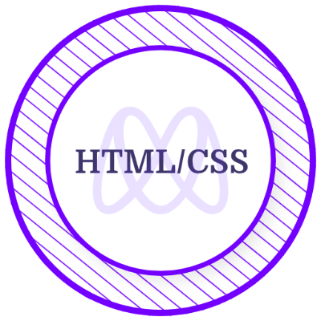
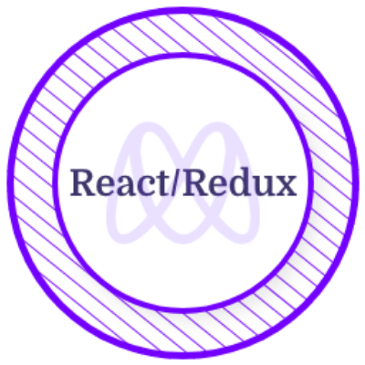
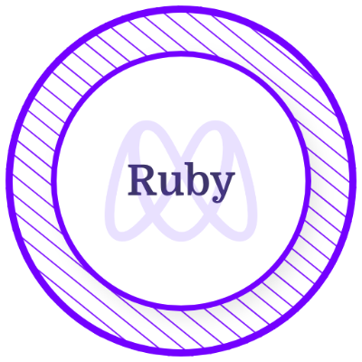
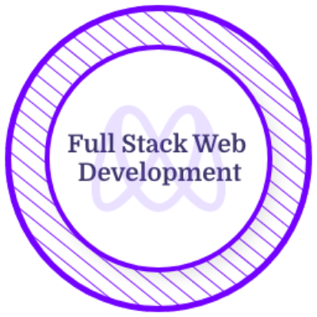

<h1  color="pink">
        𝐇𝐞𝐥𝐥𝐨, &lt;𝚌𝚘𝚍𝚎𝚛𝚜/&gt;!
  
</h1>

# 💫About Me :

  <samp>
    As a full-stack software engineer, I am passionate about crafting clean code, designing responsive web interfaces, and following test-driven development practices. I possess a deep understanding of multiple programming languages, frameworks, and technologies that allow me to work efficiently both independently and as part of a productive remote team. Quality code, teamwork, and innovative ideas are my top priorities, and I have honed these skills at Microverse, a renowned remote software development school, where I have spent the last several months practicing pair programming and remote software development with a diverse group of individuals across different time zones.
    Frontend: HTML, CSS, JavaScript, React, Redux, Bootstrap, Material UI, SASS, jQuery, AJAX, Webpack, Jest, React Testing Library, Cypress, Enzyme, and React Router.
    Backend: Ruby, Ruby on Rails, SQL, PostgreSQL, Node.js, Express.js, MongoDB, Mongoose, and RESTful APIs.
  </samp>

---
[]

  

## 🌐Socials
    
  

## 💻Tech Stack

  

 

 

 
 
  

 
  

## 📜Certificates and Licenses

  &nbsp; &nbsp; &nbsp; &nbsp; 

## 📊GitHub Stats :

 
 
 

## 🏆 GitHub Trophies

## ✍️ Random Dev Quote

